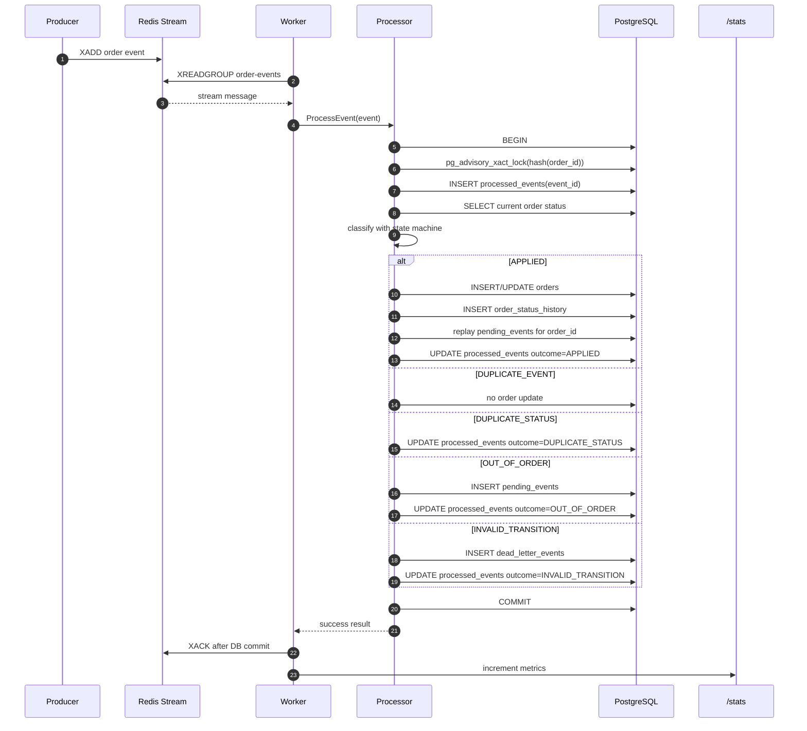
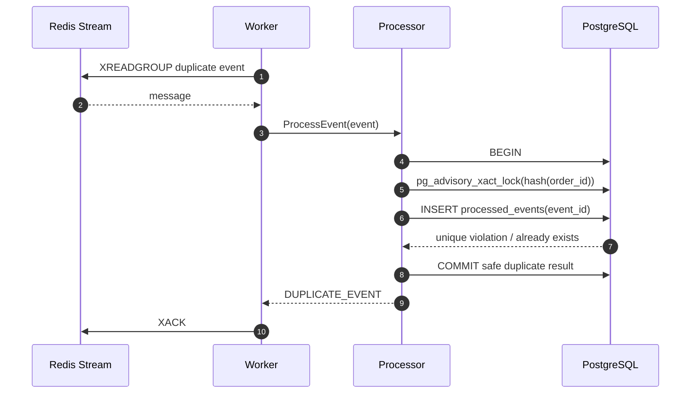
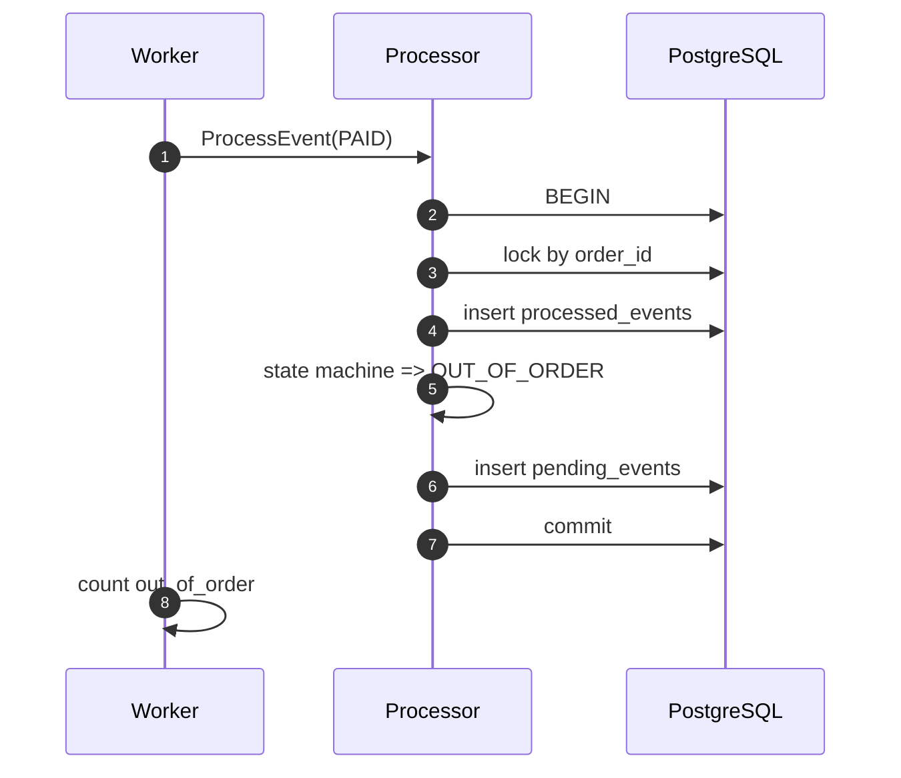
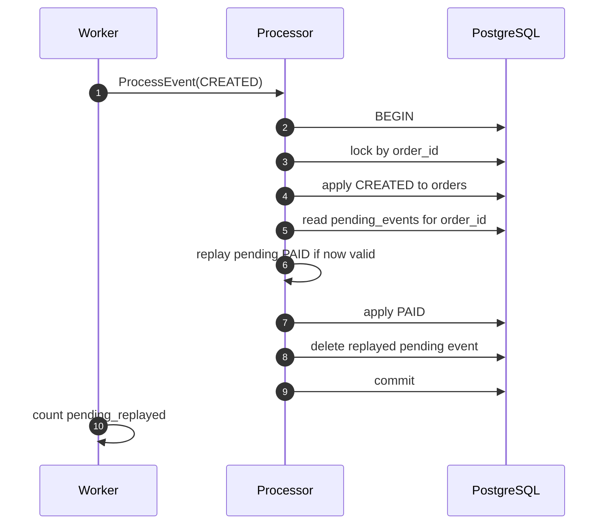
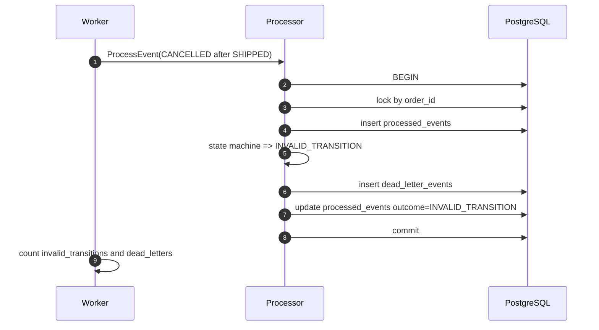
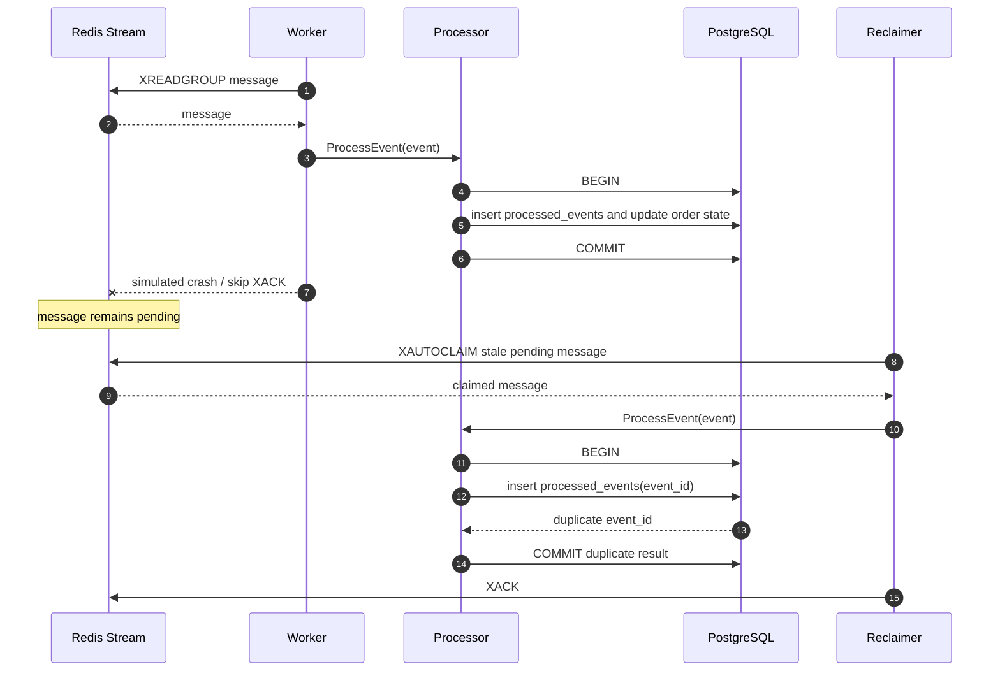
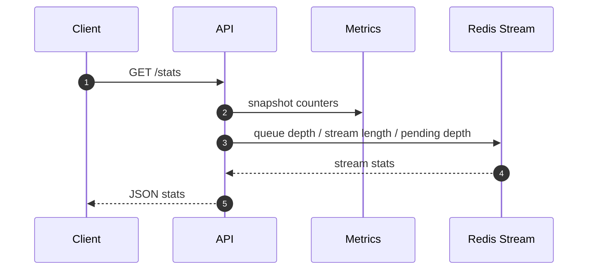

# Data Flow and Sequence Diagrams

This document explains how an order event moves through the system from producer to Redis, worker, PostgreSQL, monitoring, and recovery.

## Normal Processing Flow

## Key Ordering Rule

Redis `XACK` happens only after the PostgreSQL transaction commits.

This protects against event loss:

- If DB processing fails, the message is not acknowledged.
- If the worker crashes before `XACK`, the message remains in Redis pending entries.
- The reclaimer can claim and reprocess the pending message later.

## Duplicate Event Flow

A duplicate event is not treated as an infrastructure failure. It is a successful idempotent handling result and is safe to acknowledge.

## Recoverable Out-of-Order Flow

Example: `PAID` arrives before `CREATED`.

Later, when `CREATED` arrives:

## Invalid Transition Flow

Example: `CANCELLED` after `SHIPPED`.

Invalid transitions are acknowledged after they are safely recorded in PostgreSQL. They do not block the queue forever.

## Worker Crash and Recovery Flow

The project includes deterministic failure simulation for this case.

Failure mode:

- worker processes message
- PostgreSQL transaction commits successfully
- worker intentionally skips Redis `XACK`
- message remains in Redis pending entries
- reclaimer later claims the message
- processor sees the same `event_id` in `processed_events`
- processor returns duplicate result
- reclaimer acknowledges the message

## Monitoring Flow

Important fields:

- `processed` — successful processing attempts
- `applied` — events that changed order state
- `duplicates_skipped` — duplicate event IDs safely skipped
- `out_of_order` — recoverable events stored/replayed through pending path
- `invalid_transitions` — invalid lifecycle transitions
- `dead_letters` — events isolated in dead-letter storage
- `simulated_failures` — deterministic skipped-ack failures
- `recovered_messages` — messages reclaimed and acknowledged
- `queue_depth` — unread backlog
- `stream_length` — total retained Redis Stream entries
- `pending_depth` — messages read but not yet acknowledged
