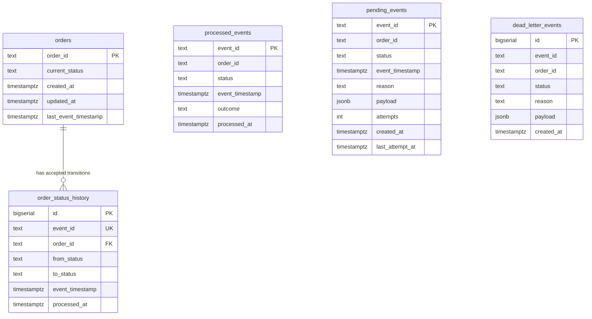

# Entity Relationship Diagram

This document describes the PostgreSQL data model used by the order ingestion service.

The schema is designed for correctness under concurrent workers. It separates current order state, idempotency records, accepted transition history, recoverable out-of-order events, and unrecoverable invalid events.

## ERD

## Tables

### `orders`

Stores the current materialized state of each order.

Important columns:

- `order_id` — primary key and stable business identifier
- `current_status` — current lifecycle state
- `last_event_timestamp` — timestamp of the latest accepted lifecycle event
- `created_at`, `updated_at` — operational timestamps

Allowed statuses:

- `CREATED`
- `PAID`
- `SHIPPED`
- `CANCELLED`

This table contains only accepted order state, not every received event.

### `processed_events`

This table is the idempotency source of truth.

Important columns:

- `event_id` — primary key
- `order_id`
- `status`
- `event_timestamp`
- `outcome`
- `processed_at`

The processor inserts into `processed_events` inside the same PostgreSQL transaction before changing order state. If the insert fails because `event_id` already exists, the event is treated as a duplicate and does not update `orders`.

This prevents duplicate Redis deliveries, producer duplicates, and recovery replays from corrupting state.

Typical outcomes include:

- `APPLIED`
- `DUPLICATE_STATUS`
- `OUT_OF_ORDER`
- `INVALID_TRANSITION`

### `order_status_history`

Stores accepted status transitions for auditability.

Important columns:

- `event_id` — unique accepted event identifier
- `order_id` — foreign key to `orders(order_id)`
- `from_status`
- `to_status`
- `event_timestamp`
- `processed_at`

Only accepted transitions are recorded here. This is why `order_status_history.order_id` references `orders`: history rows exist only after the order has a valid materialized state.

### `pending_events`

Stores recoverable out-of-order events.

Examples:

- `PAID` arrives before `CREATED`
- `SHIPPED` arrives while current status is only `CREATED`

These events may become valid later when prerequisite statuses arrive. They are stored without requiring an existing `orders` row, because the entire reason they are pending may be that the order has not been materialized yet.

Important columns:

- `event_id` — primary key
- `order_id`
- `status`
- `event_timestamp`
- `reason`
- `payload`
- `attempts`
- `last_attempt_at`

When an accepted event advances an order state, the processor attempts to replay pending events for the same `order_id` in timestamp order.

### `dead_letter_events`

Stores unrecoverable events.

Examples:

- `CANCELLED` after `SHIPPED`
- transition from `CANCELLED` to another state
- unknown or invalid status

This table also does not require an existing `orders` row. Some invalid events may refer to orders that were never validly created.

Important columns:

- `event_id`
- `order_id`
- `status`
- `reason`
- `payload`
- `created_at`

## Constraints and Indexes

The schema uses:

- primary key on `orders.order_id`
- primary key on `processed_events.event_id`
- unique constraint on `order_status_history.event_id`
- allowed-status check constraints
- indexes for operational lookups:
  - `processed_events(order_id)`
  - `order_status_history(order_id, event_timestamp)`
  - `pending_events(order_id)`
  - `dead_letter_events(order_id)`
  - `orders(current_status)`

## Why This Model Supports the Requirements

| Requirement | Schema Support |
|---|---|
| No duplicate rows from duplicate events | `processed_events.event_id` primary key |
| Idempotent recovery replay | duplicate `event_id` is detected inside PostgreSQL |
| Audit accepted lifecycle changes | `order_status_history` |
| Recover out-of-order events | `pending_events` |
| Isolate invalid transitions | `dead_letter_events` |
| Current order state query | `orders` |
| Concurrent worker safety | schema works with transaction + advisory lock by `order_id` |

## Relationship Notes

`processed_events`, `pending_events`, and `dead_letter_events` intentionally do not require a foreign key to `orders`.

Reason: an event can be received before the order exists, or it can be invalid and never create an accepted order row. Requiring a foreign key would make it impossible to record those events safely.

`order_status_history` does reference `orders` because it represents accepted transitions only.
